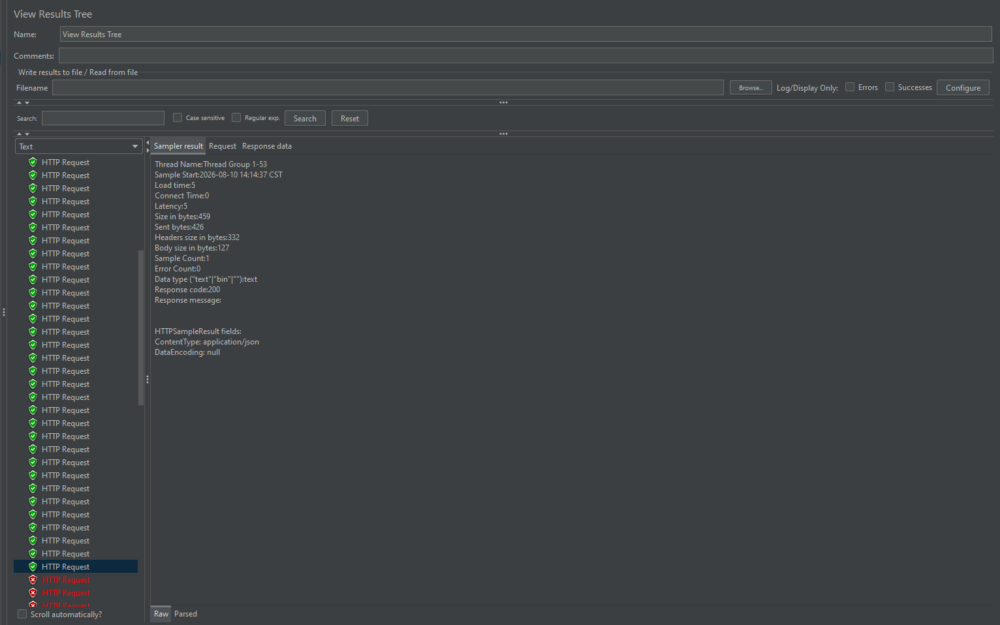
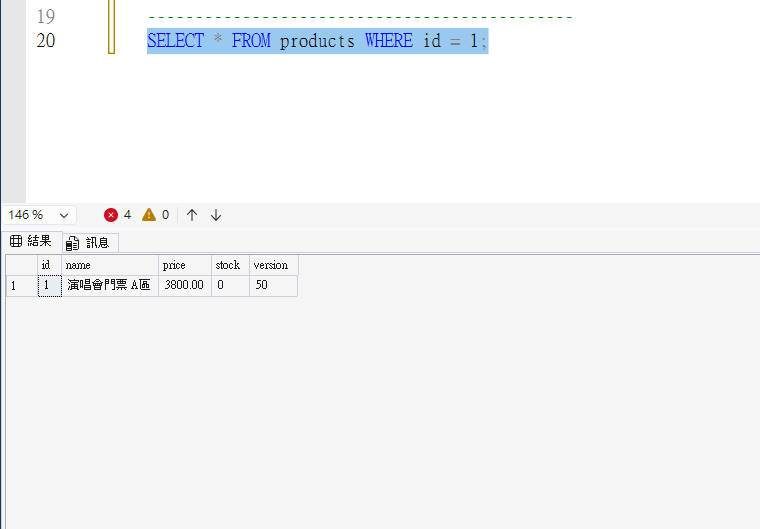

# 高併發票券搶購與訂單系統 (Ticket Concert API)

基於 **Spring Boot 3** 與 **SQL Server** 開發的後端 RESTful API 系統。針對高併發搶票情境進行設計，運用 **SQL 樂觀鎖 (Optimistic Locking)** 機制解決多線程競爭問題，並透過 **JMeter** 驗證達成 0 超賣（Zero Over-selling）。

---

## 專案結構 (Project Structure)

```text
├── src/                      # Spring Boot 後端程式碼
├── docs/                     # 存放壓測與資料庫佐證圖片
│   ├── jmeter-results.png    # JMeter 綠色/紅色壓測結果圖
│   └── ssms-db-result.png    # SSMS 庫存精準歸 0 的資料庫截圖
├── pom.xml                   # Maven 依賴管理
└── README.md                 # 專案說明文件
```

---

## 技術選型
* **Core Framework**: Spring Boot 3.x
* **Security**: Spring Security + JWT Authentication
* **Database**: SQL Server / Spring Data JPA
* **Validation**: Jakarta Bean Validation
* **Stress Testing**: Apache JMeter (100 Concurrent Threads)

---

## 高併發防超賣驗證 (Stress Testing Result)

### 1. 壓測情境設計
* **模擬目標**：100 個併發請求在 1 秒內同時發送搶票 API。
* **初始庫存**：100 張，每筆訂單扣 2 張（預期最多成功處理 50 筆）。

### 2. 測試結果
* **HTTP 200 OK**：成功處理前 50 筆訂單。
* **HTTP 400 Bad Request**：後 50 筆請求因庫存不足或樂觀鎖版本衝突，被後端 Exception Handler 精準攔截。
* **資料庫驗證**：最終 `stock` 精準降為 `0`，`version` 精準遞增至 `50`，**達成 0 超賣**。

| JMeter 壓測結果 | SSMS 資料庫最終狀態 |
| :---: | :---: |
|  |  |

---

## 專案架構亮點
1. **身分驗證**：整合 Spring Security + JWT，確保無狀態（Stateless）安全授權。
2. **資料一致性**：使用 SQL Version 欄位實現樂觀鎖，避免併發時出現 Race Condition。
3. **錯誤處理**：全域包裝 Exception，將業務失敗正確對映為 HTTP 400 狀態碼。
